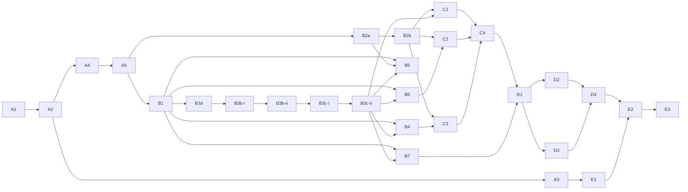

# Migration Platform V2 Tasks

> Complete the V2 as a safe, durable cPanel-to-cPanel migration platform. Each task is one PR.

## Quality Baseline

| Metric | Current | Target |
|---|---:|---:|
| API tests | 117 passing | no regressions |
| API + adapter coverage | 91% | no decrease |
| cPanel client coverage | 24% | >=90% safety paths |
| Worker tests | 17 passing via `make setup` | passing |
| Frontend build/typecheck | passing | passing |
| Frontend tests | absent | critical flows covered |
| Linter/formatter | absent | zero errors |
| Largest source file | 1988 lines | do not increase; split opportunistically |

## Current Tasks

### Wave A — Safe real runtime

| Status | ID | Task | Priority | Size | Dependencies |
|---|---|---|---|---|---|
| `[x]` | `A1` | [Reproducible worker environment](A1-worker-environment.md) | High | S | None |
| `[x]` | `A2` | [Real execution contract](A2-real-execution-contract.md) | Critical | L | A1 |
| `[x]` | `A3` | [Durable real dispatch](A3-durable-real-dispatch.md) | Critical | M | A2 |
| `[x]` | `A4` | [Account execution lease](A4-account-execution-lease.md) | Critical | M | A2 |
| `[x]` | `A5` | [Real execution safety gates](A5-real-safety-gates.md) | Critical | L | A2, A4 |

### Wave B — Adapters and configuration writers

| `[x]` | `B1` | [Harden cPanel adapter](B1-harden-cpanel-adapter.md) | High | L | A5 |
| `[/]` | `B2` | [Implement SSH adapter](B2-implement-ssh-adapter.md) (split → B2a/B2b) | High | L | A5 |
| `[x]` | `B2a` | [SSH contract, host-key security, command execution](B2a-ssh-command-execution.md) | High | M | A5 |
| `[ ]` | `B2b` | [SSH streaming, cancellation, backpressure](B2b-ssh-streaming-backpressure.md) | High | M | B2a |
| `[x]` | `B3a` | [Domain adapter and safety rules](B3a-domain-adapter-rules.md) | High | M | B1 |
| `[x]` | `B3b-i` | [Real domain write phase engine](B3b-i-domain-phase-engine.md) | High | M | B3a |
| `[x]` | `B3b-ii` | [Domain phase dispatch wiring](B3b-ii-domain-phase-dispatch.md) | High | M | B3b-i |
| `[/]` | `B3c` | [Rich domain inventory contract](B3c-rich-domain-inventory.md) (split → B3c-i/B3c-ii) | High | L | B3b-ii |
| `[x]` | `B3c-i` | [Domain inventory contract (collector)](B3c-i-domain-inventory-contract.md) | High | M | B3b-ii |
| `[x]` | `B3c-ii` | [Rich domain readiness integration](B3c-ii-domain-readiness-integration.md) | High | M | B3c-i |
| `[ ]` | `B4` | [Real email configuration writers](B4-email-config-writers.md) | High | L | B1, B3c-ii |
| `[ ]` | `B5` | [Real cron FTP list writers](B5-cron-ftp-list-writers.md) | High | L | B1, B2a, B3c-ii |
| `[ ]` | `B6` | [Real MySQL resource writers](B6-mysql-resource-writers.md) | High | L | B1, B3c-ii |
| `[ ]` | `B7` | [Additive real DNS writer](B7-additive-dns-writer.md) | High | L | B1, B3c-ii |

> `B3` è stato suddiviso in `B3a`/`B3b` (superamento previsto dei guardrail 8 file / 500 righe); vedi [B3-real-domain-writer.md](B3-real-domain-writer.md). A sua volta `B3b`, misurato a ~660 righe, è stato suddiviso in `B3b-i` (motore di fase, irraggiungibile dal runtime) e `B3b-ii` (wiring dispatch/actor); vedi [B3b-real-domain-writer-dispatch.md](B3b-real-domain-writer-dispatch.md). Gli ID `B3` e `B3b` sono ritirati e non riutilizzati.

> `B2` (Implement SSH adapter), misurato a **~1100 righe di produzione + ~600 di test su 9+ file**
> (errors + contract + command builder + host-key policy + client paramiko + streaming/backpressure
> + fake transport + ~25 test), supera i guardrail 8 file / 500 righe e il limite di 400 righe per
> file. Come previsto dal task stesso, è stato suddiviso in `B2a` (contratti tipizzati, sicurezza
> host-key, esecuzione comandi con output bounded, timeout, cancellazione, exit/signal, retry solo su
> connect, separazione strutturale source-read-only / destination-read / destination-write, fake
> deterministico) e `B2b` (stdin streaming autorizzato, stream source→destination con backpressure,
> non-buffering integrale, interruzione stream, no-retry su stream parziale, race cancellation/close).
> B2a è il minimo boundary coerente e testabile per l'esecuzione comandi verificata host-key; una
> divisione più fine produrrebbe PR intermedie non testabili (contratti senza consumatore). Le
> dipendenze downstream basate su trasferimento contenuti in streaming (`C1`/`C2`/`C3`) puntano a
> `B2b`; i writer basati su comandi (`B5`) possono partire da `B2a`. L'ID `B2` è ritirato per
> l'implementazione e non riutilizzato.

> `B3c` (Rich domain inventory contract), misurato a ~580 righe / 8–9 file, è stato suddiviso in `B3c-i` (contratto domini nel collector: produce e persiste l'envelope ricco `domains_data` fail-closed) e `B3c-ii` (integrazione readiness/gate + prova end-to-end che B3b-ii consuma i record ricchi); vedi [B3c-rich-domain-inventory.md](B3c-rich-domain-inventory.md). L'ID `B3c` è ritirato e non riutilizzato per implementazione. **B3c-ii chiude la limitazione residua (a) di B3b-ii** (inventario privo dell'envelope ricco → passi dominio manual/pending); la limitazione crash/recovery di B3b-ii resta assegnata a **C4**. Le categorie downstream (`B4`/`B5`/`B6`/`B7`/`C1`) dipendono ora da `B3c-ii`.

### Wave C — Content transfer

| `[ ]` | `C1` | [Website content transfer](C1-website-content-transfer.md) | High | L | B2b, B3c-ii |
| `[ ]` | `C2` | [Database content transfer](C2-database-content-transfer.md) | High | L | B2b, B6 |
| `[ ]` | `C3` | [Mailbox content transfer](C3-mailbox-content-transfer.md) | High | L | B2b, B4 |
| `[ ]` | `C4` | [Transfer checkpoint resume](C4-transfer-checkpoint-resume.md) | High | L | C1, C2, C3 |

### Wave D — Verification and recovery

| `[ ]` | `D1` | [Post-write inventory loop](D1-post-write-inventory.md) | Medium | M | C4, B7 |
| `[ ]` | `D2` | [Deep content verification](D2-deep-content-verification.md) | Medium | L | D1 |
| `[ ]` | `D3` | [Compensation and rollback](D3-compensation-rollback.md) | Medium | L | D1 |
| `[ ]` | `D4` | [Go-no-go cutover workflow](D4-cutover-workflow.md) | Medium | L | D2, D3 |

### Wave E — Production readiness

| `[ ]` | `E1` | [Quality gates and CI](E1-quality-gates-ci.md) | Medium | L | A3 |
| `[ ]` | `E2` | [Sandbox cPanel E2E](E2-sandbox-cpanel-e2e.md) | Medium | L | D4, E1 |
| `[ ]` | `E3` | [Pilot migration runbook](E3-pilot-migration-runbook.md) | Low | M | E2 |

## Dependency Graph

## Guardrails

- Maximum eight files and 500 changed lines per PR; split larger work.
- Source writes are forbidden and require explicit invariant tests.
- Real writer modes remain disabled by default.
- No stale/partial evidence may authorize a write.
- No secret may enter logs, events, queue payloads, or API responses.

