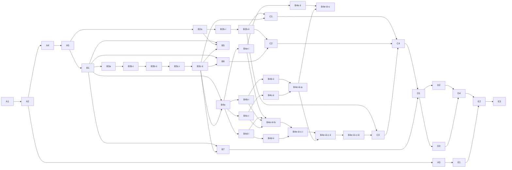

# Migration Platform V2 Tasks

> Complete the V2 as a safe, durable cPanel-to-cPanel migration platform. Each task is one PR.

## Quality Baseline

| Metric | Current | Target |
|---|---:|---:|
| API tests | 117 passing | no regressions |
| API + adapter coverage | 91% | no decrease |
| cPanel client coverage | 24% | >=90% safety paths |
| Worker tests | 17 passing via `make setup` | passing |
| Frontend build/typecheck | passing | passing |
| Frontend tests | absent | critical flows covered |
| Linter/formatter | absent | zero errors |
| Largest source file | 1988 lines | do not increase; split opportunistically |

## Current Tasks

### Wave A — Safe real runtime

| Status | ID | Task | Priority | Size | Dependencies |
|---|---|---|---|---|---|
| `[x]` | `A1` | [Reproducible worker environment](A1-worker-environment.md) | High | S | None |
| `[x]` | `A2` | [Real execution contract](A2-real-execution-contract.md) | Critical | L | A1 |
| `[x]` | `A3` | [Durable real dispatch](A3-durable-real-dispatch.md) | Critical | M | A2 |
| `[x]` | `A4` | [Account execution lease](A4-account-execution-lease.md) | Critical | M | A2 |
| `[x]` | `A5` | [Real execution safety gates](A5-real-safety-gates.md) | Critical | L | A2, A4 |

### Wave B — Adapters and configuration writers

| `[x]` | `B1` | [Harden cPanel adapter](B1-harden-cpanel-adapter.md) | High | L | A5 |
| `[/]` | `B2` | [Implement SSH adapter](B2-implement-ssh-adapter.md) (split → B2a/B2b) | High | L | A5 |
| `[x]` | `B2a` | [SSH contract, host-key security, command execution](B2a-ssh-command-execution.md) | High | M | A5 |
| `[/]` | `B2b` | [SSH streaming, cancellation, backpressure](B2b-ssh-streaming-backpressure.md) (split → B2b-i/B2b-ii) | High | M | B2a |
| `[x]` | `B2b-i` | [SSH stream contracts, pump, fake](B2b-i-ssh-stream-pump.md) | High | M | B2a |
| `[x]` | `B2b-ii` | [SSH stream session wiring and paramiko lifecycle](B2b-ii-ssh-stream-sessions.md) | High | M | B2b-i |
| `[x]` | `B3a` | [Domain adapter and safety rules](B3a-domain-adapter-rules.md) | High | M | B1 |
| `[x]` | `B3b-i` | [Real domain write phase engine](B3b-i-domain-phase-engine.md) | High | M | B3a |
| `[x]` | `B3b-ii` | [Domain phase dispatch wiring](B3b-ii-domain-phase-dispatch.md) | High | M | B3b-i |
| `[/]` | `B3c` | [Rich domain inventory contract](B3c-rich-domain-inventory.md) (split → B3c-i/B3c-ii) | High | L | B3b-ii |
| `[x]` | `B3c-i` | [Domain inventory contract (collector)](B3c-i-domain-inventory-contract.md) | High | M | B3b-ii |
| `[x]` | `B3c-ii` | [Rich domain readiness integration](B3c-ii-domain-readiness-integration.md) | High | M | B3c-i |
| `[/]` | `B4` | [Real email configuration writers](B4-email-config-writers.md) (split → B4a–B4e) | High | L | B1, B3c-ii |
| `[x]` | `B4a` | [Email writer framework + forwarder](B4a-email-framework-forwarder.md) | High | M | B1, B3c-ii |
| `[/]` | `B4b` | [Default address / catch-all writer](B4b-default-address-writer.md) (split → B4b-i/B4b-ii) | High | M | B4a |
| `[x]` | `B4b-i` | [Default-address evidence contract and rules](B4b-i-default-address-contract.md) | High | M | B4a |
| `[x]` | `B4b-ii` | [Compensable default-address writer engine](B4b-ii-default-address-writer-engine.md) | High | M | B4b-i |
| `[/]` | `B4c` | [Email routing writer](B4c-email-routing-writer.md) (split → B4c-i/B4c-ii) | High | M | B4a |
| `[x]` | `B4c-i` | [Routing evidence contract and rules](B4c-i-routing-contract.md) | High | M | B4a |
| `[x]` | `B4c-ii` | [Compensable routing writer engine](B4c-ii-routing-writer-engine.md) | High | M | B4c-i |
| `[/]` | `B4d` | [Email filters writer](B4d-email-filters-writer.md) (split → B4d-i/B4d-ii) | High | M | B4a |
| `[x]` | `B4d-i` | [Filter evidence contract, fingerprint and rules](B4d-i-filter-contract.md) | High | M | B4a |
| `[x]` | `B4d-ii` | [Additive-only filter writer engine](B4d-ii-filter-writer-engine.md) | High | M | B4d-i |
| `[/]` | `B4e` | [Autoresponder writer + email dispatch integration](B4e-autoresponder-dispatch.md) (split → B4e-i/ii/iii) | High | L | B4a, B4b-ii, B4c-ii, B4d-ii |
| `[x]` | `B4e-i` | [Autoresponder evidence contract and rules](B4e-i-autoresponder-contract.md) | High | M | B4a |
| `[x]` | `B4e-ii` | [Additive-only autoresponder writer engine](B4e-ii-autoresponder-writer-engine.md) | High | M | B4e-i |
| `[/]` | `B4e-iii` | [Email phases pipeline and dispatch integration](B4e-iii-email-dispatch-integration.md) (split → iii-a/b/c) | High | L | B4e-ii, B4a, B4b-ii, B4c-ii, B4d-ii |
| `[x]` | `B4e-iii-a` | [Durable email backup store](B4e-iii-a-durable-email-backup-store.md) | High | M | B4b-ii, B4c-ii |
| `[x]` | `B4e-iii-b` | [Email categories pipeline integration](B4e-iii-b-email-categories-pipeline.md) | High | M | B4e-i, B4d-i, B4b-i, B4c-i |
| `[/]` | `B4e-iii-c` | [Email runtime registry and dispatch](B4e-iii-c-email-runtime-registry-dispatch.md) (split → c-i/c-ii/c-iii) | High | L | B4e-iii-a, B4e-iii-b, B4e-ii, B4a, B4b-ii, B4c-ii, B4d-ii |
| `[x]` | `B4e-iii-c-i` | [Email registry and evidence resolvers](B4e-iii-c-i-email-registry-resolvers.md) | High | M | B4e-iii-b, B4e-ii, B4a, B4b-ii, B4c-ii, B4d-ii |
| `[x]` | `B4e-iii-c-ii` | [Destination gateways and durable backup bindings](B4e-iii-c-ii-email-gateways-backups.md) | High | M | B4e-iii-c-i, B4e-iii-a |
| `[ ]` | `B4e-iii-c-iii` | [Worker email dispatch and terminal semantics](B4e-iii-c-iii-email-worker-dispatch.md) | High | M | B4e-iii-c-ii |
| `[ ]` | `B5` | [Real cron FTP list writers](B5-cron-ftp-list-writers.md) | High | L | B1, B2a, B3c-ii |
| `[ ]` | `B6` | [Real MySQL resource writers](B6-mysql-resource-writers.md) | High | L | B1, B3c-ii |
| `[ ]` | `B7` | [Additive real DNS writer](B7-additive-dns-writer.md) | High | L | B1, B3c-ii |

> `B3` è stato suddiviso in `B3a`/`B3b` (superamento previsto dei guardrail 8 file / 500 righe); vedi [B3-real-domain-writer.md](B3-real-domain-writer.md). A sua volta `B3b`, misurato a ~660 righe, è stato suddiviso in `B3b-i` (motore di fase, irraggiungibile dal runtime) e `B3b-ii` (wiring dispatch/actor); vedi [B3b-real-domain-writer-dispatch.md](B3b-real-domain-writer-dispatch.md). Gli ID `B3` e `B3b` sono ritirati e non riutilizzati.

> `B2` (Implement SSH adapter), misurato a **~1100 righe di produzione + ~600 di test su 9+ file**
> (errors + contract + command builder + host-key policy + client paramiko + streaming/backpressure
> + fake transport + ~25 test), supera i guardrail 8 file / 500 righe e il limite di 400 righe per
> file. Come previsto dal task stesso, è stato suddiviso in `B2a` (contratti tipizzati, sicurezza
> host-key, esecuzione comandi con output bounded, timeout, cancellazione, exit/signal, retry solo su
> connect, separazione strutturale source-read-only / destination-read / destination-write, fake
> deterministico) e `B2b` (stdin streaming autorizzato, stream source→destination con backpressure,
> non-buffering integrale, interruzione stream, no-retry su stream parziale, race cancellation/close).
> B2a è il minimo boundary coerente e testabile per l'esecuzione comandi verificata host-key; una
> divisione più fine produrrebbe PR intermedie non testabili (contratti senza consumatore). Le
> dipendenze downstream basate su trasferimento contenuti in streaming (`C1`/`C2`/`C3`) puntano a
> `B2b`; i writer basati su comandi (`B5`) possono partire da `B2a`. L'ID `B2` è ritirato per
> l'implementazione e non riutilizzato.

> `B2b` (SSH streaming, cancellation, backpressure), misurato a **~1080 righe su ~9 file**
> (streaming.py contratti+pump ~270, wiring `client.py` ~70, streaming paramiko ~70, fake
> source/sink ~150, ~460 di test, ~50 doc), supera i guardrail 8 file / 500 righe. Come previsto
> dal task, è stato suddiviso in `B2b-i` (contratti di streaming tipizzati, motore `pump()`
> backpressured/bounded/cancellabile con risultato parziale tipizzato, fake source/sink
> deterministico e test del pump) e `B2b-ii` (wiring dei ruoli sulle sessioni —
> `SourceReadSession.start_stdout` / `DestinationWriteSession.start_stdin` autorizzato — backend
> paramiko di streaming, test strutturali e integrazione, doc). B2b-i è il minimo boundary
> testabile del motore di streaming (il pump opera su protocolli `ByteSource`/`StdinSink`, testato
> contro il fake senza sessioni né rete); B2b-ii collega i ruoli e il trasporto reale. Le
> dipendenze di trasferimento contenuti (`C1`/`C2`/`C3`) puntano a `B2b-ii` (streaming end-to-end).
> L'ID `B2b` è ritirato per l'implementazione.

> `B4` (Real email configuration writers), misurato a **~3200–3800 righe su ~25–30 file** (5 categorie
> con semantiche di sicurezza distinte — forwarder additivo/dedup, default-address che **sovrascrive** il
> catch-all, autoresponder/filtri **UPSERT**, routing MX; 3 categorie prive di evidence/flag), oltre i
> guardrail 8 file / 500 righe di ~7×. Anche lo split a 3 suggerito dal task resta ~1000–1530 righe per
> sotto-task. Su conferma dell'utente è stato suddiviso **per-capability** in 5 sotto-task, ognuno ≈ una
> categoria testabile ≤~700 righe (aderente al precedente B3b), dietro un flag reale exact-match
> disabled-by-default e non cablato/raggiungibile finché il rispettivo wiring sicuro non è completo:
>
> - [`B4a` — Email writer framework + forwarder](B4a-email-framework-forwarder.md) (dep: B1, B3c-ii)
> - [`B4b` — Default address / catch-all writer](B4b-default-address-writer.md) (dep: B4a)
> - [`B4c` — Email routing writer](B4c-email-routing-writer.md) (dep: B4a)
> - [`B4d` — Email filters writer](B4d-email-filters-writer.md) (dep: B4a)
> - [`B4e` — Autoresponder writer + email dispatch integration](B4e-autoresponder-dispatch.md) (dep: B4a–B4d)
>
> B4a stabilisce il framework condiviso (gateway per-item fresh-read→decide→gated-write→verify-live→
> compensation redatta, eventi evidence, flag) validandolo con la categoria più semplice (forwarder
> additivo). Le categorie downstream che dipendono dalla configurazione email completa (`C3`) puntano a
> `B4e` (integrazione dispatch finale). L'ID `B4` è ritirato per l'implementazione e non riutilizzato.

> `B4b` (Default address / catch-all writer), misurato a **~850 righe su 7 file** (contratto collector
> ~70, `default_address_rules.py` ~150, `default_address_writer.py` ~140, seam compensabile in
> `email_write.py` ~40, `config.py` ~20, ~400 test, ~30 doc), supera di ~1,7× il budget di 500 righe/PR
> (il file count regge; le righe no). Nulla è riutilizzabile: non esistono collector, regole, mock,
> categoria di plan o sezione comparison per `default_address`. Su conferma dell'utente è stato suddiviso
> al confine **evidence/rules → writer engine** in due sotto-task ognuno ≤8 file / ≤500 righe:
>
> - [`B4b-i` — Default-address evidence contract and rules](B4b-i-default-address-contract.md) (dep: B4a):
>   SafeRead `Email::list_default_address`, DestinationWrite tipizzata `Email::set_default_address`
>   (costruibile/testabile ma irraggiungibile), contratto `default_address_contract` versionato,
>   classificazione opaca pura (`fail`/`blackhole`/`account_default`/`address`/`other`) con username
>   sorgente/destinazione legati all'evidenza, regole pure (`already_present`/`set`/`blocked`/`manual`,
>   nessuna write), flag `DEFAULT_ADDRESS_WRITER_MODE` disabled-by-default. Nessuna modifica a
>   `email_write.py`, nessun engine, nessun dispatch, nessuna chiamata reale.
> - [`B4b-ii` — Compensable default-address writer engine](B4b-ii-default-address-writer-engine.md)
>   (dep: B4b-i): seam `backup_of` in `email_write.py` (backup redatto persistito **prima** della write,
>   backup-fallito→zero-write), `default_address_writer.py` compensabile (fresh-read→decide→backup→gated
>   `set`→verify live→compensation) che riusa `execute_email_phase` senza duplicare il lifecycle. Non
>   cablato nel dispatch (resta a B4e).
>
> `B4e` dipende ora da `B4b-ii` (non più `B4b`); `B4b-i → B4b-ii`. L'ID `B4b` è ritirato per
> l'implementazione e non riutilizzato.

> `B4c` (Email routing writer), misurato a **~895 righe su 7 file** (`routing_rules.py` ~200,
> `routing_writer.py` ~150, contratto collector ~45, `config.py` ~20, ~450 test, ~30 doc), supera
> ~1,8× il budget di 500 righe/PR. Nulla è riutilizzabile (nessun collector/regole/mock/plan/comparison
> per `email_routing`); il seam `backup_of`/`persist_backup` di B4b-ii è riusato da B4c-ii, quindi
> `email_write.py` non viene toccato. Lettura `Email::list_mxs` (UAPI), write `Email::setmxcheck` (API2,
> overwrite). Semantica vincolante (confermata): nessuno stato dest è "fresh" per default; la policy di
> overwrite è **vuota per default** e un `set` è raggiungibile solo con policy esplicita, approvata ed
> **evidence-bound** che autorizza esattamente la transizione osservata (dominio + stato dest live +
> stato source richiesto); `secondary` sempre manuale; `detected`/MX/DNS mai decisionali. Su conferma
> dell'utente suddiviso al confine **evidence/rules → writer engine**:
>
> - [`B4c-i` — Routing evidence contract and rules](B4c-i-routing-contract.md) (dep: B4a): op tipizzate
>   SafeRead `list_mxs` + DestinationWrite `setmxcheck` (irraggiungibili), contratto
>   `email_routing_contract` versionato, classificazione `local`/`remote`/`auto`/`secondary`/`unknown`,
>   policy model evidence-bound + validazione, matrice decisionale pura, flag `ROUTING_WRITER_MODE`
>   disabled-by-default. Nessun engine/dispatch/write.
> - [`B4c-ii` — Compensable routing writer engine](B4c-ii-routing-writer-engine.md) (dep: B4c-i):
>   `routing_writer.py` che riusa `execute_email_phase` e il seam B4b-ii esistente (nessuna modifica a
>   `email_write.py`). Non cablato nel dispatch (resta a B4e).
>
> `B4e` dipende ora da `B4c-ii` (non più `B4c`); `B4c-i → B4c-ii`. L'ID `B4c` è ritirato per
> l'implementazione e non riutilizzato.

> `B4e` (Autoresponder writer + email dispatch integration), misurato a **~2465 righe su ~18 file**
> (autoresponder contract/rules ~365 + engine ~200 + integrazione dispatch ~480 di produzione — refactor
> `dispatch.py` mono-categoria in registry uniforme a 5 engine con interfacce eterogenee, store backup
> durevole con tabella+migrazione Alembic, autorizzazione/fencing per-categoria e per-write, commit
> atomico, semantica terminale — più ~1290 di test e ~130 di doc), oltre ~5× il budget 500 righe/PR.
> Analisi (2026-07-12): `default_address` e `email_routing` **non esistono** come categoria in
> comparison/plan/preview/readiness (solo contratti evidence per-dominio); l'autoresponder è `MANUAL`
> (escluso dal preview); **non esiste uno store backup durevole** (`persist_backup` è solo callback nei
> test) mentre i writer default-address/routing lo richiedono (backup-or-nothing); interfacce engine
> non uniformi; l'actor A3 non riprende un attempt `running` (recovery resta a `C4`); nessuno stato
> `partial` (`halted` modella il successo parziale). Su conferma dell'utente, suddiviso al confine
> **contract/rules → engine → dispatch**:
>
> - [`B4e-i` — Autoresponder evidence contract and rules](B4e-i-autoresponder-contract.md) (dep: B4a):
>   op tipizzate `list_auto_responders`/`get_auto_responder`/`add_auto_responder` (irraggiungibile),
>   contratto `autoresponder_contract` versionato per-dominio, canonical fingerprint completo
>   (from/subject/body/interval/is_html/charset/start/stop, sensibili redatti), regole additive pure,
>   flag `AUTORESPONDER_WRITER_MODE`. Nessun engine/dispatch/write.
> - [`B4e-ii` — Additive-only autoresponder writer engine](B4e-ii-autoresponder-writer-engine.md)
>   (dep: B4e-i): nuovo `real_autoresponder_writer.py` (il mock resta intatto), riusa
>   `execute_email_phase`, due fresh-read anti-upsert, verify per fingerprint, compensation redatta.
>   Non cablato nel dispatch.
> - [`B4e-iii` — Email phases pipeline and dispatch integration](B4e-iii-email-dispatch-integration.md)
>   (dep: B4e-ii, B4a, B4b-ii, B4c-ii, B4d-ii): **task aggregatore ritirato `[/]`**, suddiviso (dopo
>   B4e-ii, con misurazione aggiornata) in tre sotto-task effettivi:
>   - [`B4e-iii-a` — Durable email backup store](B4e-iii-a-durable-email-backup-store.md)
>     (dep: B4b-ii, B4c-ii): store PostgreSQL durevole e **cifrato** per i backup pre-write di
>     default-address e routing (tabella `email_write_backups` + migrazione Alembic + modello +
>     servizio interno `persist_email_backup`/`load_email_backup`), con persistenza atomica,
>     idempotenza, fencing (A4) e assenza di plaintext. Nessun writer/dispatch cablato. **AD2
>     confermata:** nessuna write compensabile default-address/routing è cablabile finché questo
>     store non è completo.
>   - [`B4e-iii-b` — Email categories pipeline integration](B4e-iii-b-email-categories-pipeline.md)
>     (dep: B4e-i, B4d-i, B4b-i, B4c-i): rende `default_address`/`email_routing`/autoresponder
>     categorie/step **evidence-bound** esplicite in comparison/plan/preview/readiness (**AD1
>     confermata:** estendere la pipeline, non lasciarle follow-up facoltativi né una categoria
>     `email` generica; ogni categoria resta evidence-bound e disabled by default).
>   - [`B4e-iii-c` — Email runtime registry and dispatch](B4e-iii-c-email-runtime-registry-dispatch.md)
>     (retired `[/]`, split → c-i/c-ii/c-iii): registry uniforme che collega
>     forwarder/default-address/routing/filtri/autoresponder al **worker reale**, con gate/fencing
>     per-categoria e per-write (`before_write`), commit atomico run+attempt, checkpoint e semantica
>     terminale esplicita.
>
> `C3` dipende ora da `B4e-iii-c-iii` (non più `B4e-iii`); `B4a → B4e-i → B4e-ii → {B4e-iii-a,
> B4e-iii-b} → B4e-iii-c-i → B4e-iii-c-ii → B4e-iii-c-iii → C3`. Gli ID `B4e`, `B4e-iii` e
> `B4e-iii-c` sono ritirati per l'implementazione (restano come contenitori documentali dello split).
> C4 resta responsabile del resume degli attempt `running`.

> `B4d` (Email filters writer), misurato a **~1365 righe su ~7 file** (`filter_rules.py` op tipizzate +
> canonical fingerprint ordinato + contratto 2-scope + regole pure ~300, `filter_writer.py` engine +
> upsert-guard ~170, `config.py` ~15, `test_filter_rules.py` ~380, `test_real_filter_writer.py` ~450,
> README + `.env.example` ~50), oltre ~2,7× il budget di 500 righe/PR (il solo codice di produzione
> ~485 è già al limite senza test/doc). Nulla è riutilizzabile: non esistono op tipizzate Python filtri,
> né un contratto versionato con fingerprint (il collector attuale è una lista piatta). Lettura
> `Email::list_filters` (UAPI) per scope account e mailbox, dettaglio `Email::get_filter` (UAPI), write
> `Email::store_filter` (API2) che **UPSERT** (non idempotente, pericolosa). Fatto critico: `get_filter`
> su filtro inesistente ritorna un **TEMPLATE** (`status:1`, `filtername="Rule 1"`) non un errore →
> l'esistenza va gateata **solo** su `list_filters`. Su conferma dell'utente suddiviso al confine
> **evidence/rules → additive-only engine**:
>
> - [`B4d-i` — Filter evidence contract, fingerprint and rules](B4d-i-filter-contract.md) (dep: B4a):
>   SafeRead tipizzate `list_filters` (account + mailbox) e `get_filter` (solo dopo esistenza provata
>   dalla lista), DestinationWrite `store_filter` (API2, costruibile ma irraggiungibile), contratto
>   `email_filters` versionato a due scope (account + mailbox `local@domain`) fail-closed, canonical
>   fingerprint deterministico completo e ordinato sul payload (rules/actions, nessun sorting/
>   normalizzazione, distinzione null/empty/missing/zero), classificazione/completezza,
>   matrice decisionale pura (`already_present`/`create`/`blocked`/`manual`, nessuna write), flag
>   `FILTER_WRITER_MODE` disabled-by-default. Nessun engine/dispatch/write, nessun `DeleteFilter`.
> - [`B4d-ii` — Additive-only filter writer engine](B4d-ii-filter-writer-engine.md) (dep: B4d-i):
>   `filter_writer.py` che riusa `execute_email_phase`, gateway destination-only, fresh-read per scope,
>   **upsert-guard** immediatamente prima della `store_filter` (nome live-assente obbligatorio; nome
>   comparso tra snapshot e write → block; fresh-read inaffidabile → zero write), nessun `DeleteFilter`,
>   verify via fingerprint completo, compensation redatta (rimozione futura del solo filtro creato).
>   Non cablato nel dispatch (resta a B4e).
>
> `B4e` dipende ora da `B4d-ii` (non più `B4d`); `B4d-i → B4d-ii`. L'ID `B4d` è ritirato per
> l'implementazione e non riutilizzato.

> `B3c` (Rich domain inventory contract), misurato a ~580 righe / 8–9 file, è stato suddiviso in `B3c-i` (contratto domini nel collector: produce e persiste l'envelope ricco `domains_data` fail-closed) e `B3c-ii` (integrazione readiness/gate + prova end-to-end che B3b-ii consuma i record ricchi); vedi [B3c-rich-domain-inventory.md](B3c-rich-domain-inventory.md). L'ID `B3c` è ritirato e non riutilizzato per implementazione. **B3c-ii chiude la limitazione residua (a) di B3b-ii** (inventario privo dell'envelope ricco → passi dominio manual/pending); la limitazione crash/recovery di B3b-ii resta assegnata a **C4**. Le categorie downstream (`B4`/`B5`/`B6`/`B7`/`C1`) dipendono ora da `B3c-ii`.

### Wave C — Content transfer

| `[ ]` | `C1` | [Website content transfer](C1-website-content-transfer.md) | High | L | B2b-ii, B3c-ii |
| `[ ]` | `C2` | [Database content transfer](C2-database-content-transfer.md) | High | L | B2b-ii, B6 |
| `[ ]` | `C3` | [Mailbox content transfer](C3-mailbox-content-transfer.md) | High | L | B2b-ii, B4e-iii-c-iii |
| `[ ]` | `C4` | [Transfer checkpoint resume](C4-transfer-checkpoint-resume.md) | High | L | C1, C2, C3 |

### Wave D — Verification and recovery

| `[ ]` | `D1` | [Post-write inventory loop](D1-post-write-inventory.md) | Medium | M | C4, B7 |
| `[ ]` | `D2` | [Deep content verification](D2-deep-content-verification.md) | Medium | L | D1 |
| `[ ]` | `D3` | [Compensation and rollback](D3-compensation-rollback.md) | Medium | L | D1 |
| `[ ]` | `D4` | [Go-no-go cutover workflow](D4-cutover-workflow.md) | Medium | L | D2, D3 |

### Wave E — Production readiness

| `[ ]` | `E1` | [Quality gates and CI](E1-quality-gates-ci.md) | Medium | L | A3 |
| `[ ]` | `E2` | [Sandbox cPanel E2E](E2-sandbox-cpanel-e2e.md) | Medium | L | D4, E1 |
| `[ ]` | `E3` | [Pilot migration runbook](E3-pilot-migration-runbook.md) | Low | M | E2 |

## Dependency Graph

## Guardrails

- Maximum eight files and 500 changed lines per PR; split larger work.
- Source writes are forbidden and require explicit invariant tests.
- Real writer modes remain disabled by default.
- No stale/partial evidence may authorize a write.
- No secret may enter logs, events, queue payloads, or API responses.
