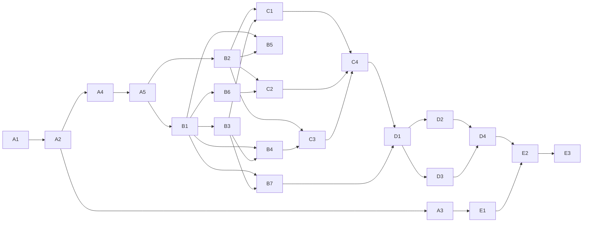

# Migration Platform V2 Tasks

> Complete the V2 as a safe, durable cPanel-to-cPanel migration platform. Each task is one PR.

## Quality Baseline

| Metric | Current | Target |
|---|---:|---:|
| API tests | 117 passing | no regressions |
| API + adapter coverage | 91% | no decrease |
| cPanel client coverage | 24% | >=90% safety paths |
| Worker tests | 17 passing via `make setup` | passing |
| Frontend build/typecheck | passing | passing |
| Frontend tests | absent | critical flows covered |
| Linter/formatter | absent | zero errors |
| Largest source file | 1988 lines | do not increase; split opportunistically |

## Current Tasks

### Wave A — Safe real runtime

| Status | ID | Task | Priority | Size | Dependencies |
|---|---|---|---|---|---|
| `[x]` | `A1` | [Reproducible worker environment](A1-worker-environment.md) | High | S | None |
| `[ ]` | `A2` | [Real execution contract](A2-real-execution-contract.md) | Critical | L | A1 |
| `[ ]` | `A3` | [Durable real dispatch](A3-durable-real-dispatch.md) | Critical | M | A2 |
| `[ ]` | `A4` | [Account execution lease](A4-account-execution-lease.md) | Critical | M | A2 |
| `[ ]` | `A5` | [Real execution safety gates](A5-real-safety-gates.md) | Critical | L | A2, A4 |

### Wave B — Adapters and configuration writers

| `[ ]` | `B1` | [Harden cPanel adapter](B1-harden-cpanel-adapter.md) | High | L | A5 |
| `[ ]` | `B2` | [Implement SSH adapter](B2-implement-ssh-adapter.md) | High | L | A5 |
| `[ ]` | `B3` | [Real domain writer](B3-real-domain-writer.md) | High | M | B1 |
| `[ ]` | `B4` | [Real email configuration writers](B4-email-config-writers.md) | High | L | B1, B3 |
| `[ ]` | `B5` | [Real cron FTP list writers](B5-cron-ftp-list-writers.md) | High | L | B1, B2, B3 |
| `[ ]` | `B6` | [Real MySQL resource writers](B6-mysql-resource-writers.md) | High | L | B1, B3 |
| `[ ]` | `B7` | [Additive real DNS writer](B7-additive-dns-writer.md) | High | L | B1, B3 |

### Wave C — Content transfer

| `[ ]` | `C1` | [Website content transfer](C1-website-content-transfer.md) | High | L | B2, B3 |
| `[ ]` | `C2` | [Database content transfer](C2-database-content-transfer.md) | High | L | B2, B6 |
| `[ ]` | `C3` | [Mailbox content transfer](C3-mailbox-content-transfer.md) | High | L | B2, B4 |
| `[ ]` | `C4` | [Transfer checkpoint resume](C4-transfer-checkpoint-resume.md) | High | L | C1, C2, C3 |

### Wave D — Verification and recovery

| `[ ]` | `D1` | [Post-write inventory loop](D1-post-write-inventory.md) | Medium | M | C4, B7 |
| `[ ]` | `D2` | [Deep content verification](D2-deep-content-verification.md) | Medium | L | D1 |
| `[ ]` | `D3` | [Compensation and rollback](D3-compensation-rollback.md) | Medium | L | D1 |
| `[ ]` | `D4` | [Go-no-go cutover workflow](D4-cutover-workflow.md) | Medium | L | D2, D3 |

### Wave E — Production readiness

| `[ ]` | `E1` | [Quality gates and CI](E1-quality-gates-ci.md) | Medium | L | A3 |
| `[ ]` | `E2` | [Sandbox cPanel E2E](E2-sandbox-cpanel-e2e.md) | Medium | L | D4, E1 |
| `[ ]` | `E3` | [Pilot migration runbook](E3-pilot-migration-runbook.md) | Low | M | E2 |

## Dependency Graph

## Guardrails

- Maximum eight files and 500 changed lines per PR; split larger work.
- Source writes are forbidden and require explicit invariant tests.
- Real writer modes remain disabled by default.
- No stale/partial evidence may authorize a write.
- No secret may enter logs, events, queue payloads, or API responses.

